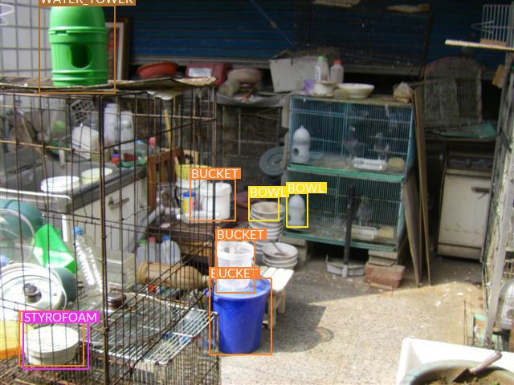
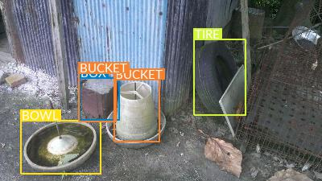
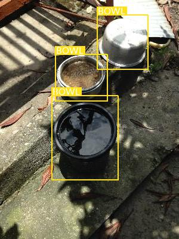

# DL-object-detection

This is assignment 6 of Deep Learning, a course at Institute of Data Science, National Cheng Kung University. This project aims to utilize deep learning techniques to perform object detection. We implement with PyTorch.

## Codes

- `main.py`: the main program for training and evaluation
- `predict.py`: the main program for prediction
- `args.py` defines the argument parser.
- `trainer.py` defines the trainer.
- `model.py` defines the model.
- `datasets.py` defines the class of training dataset with the torch.nn module.
- `utils.py`: tools for data loading 

## Data

Please go to the page of the competition on the AIdea [here](https://aidea-web.tw/topic/cc2d8ec6-dfaf-42bd-8a4a-435bffc8d071) to download the following data.

- `./train_cdc/train_images/` contains 2,671 training images with the format of JPG.
- `./test_cdc/test_images/` contains 2,248 testing images with the format of JPG.
- `./train_cdc/train_annotations/`: XML files of annotations for images under `./train_cdc/train_images/` with the format of PASCAL VOC. An XML file contains `filename`, `size`, and `object` of a single image. Each object has the `name` and (`xmin`, `ymin`) and (`xmax`, `ymax`) for the bounding box.

Please run `utils.py` with `python3 utils.py`command to obtain the following files:

- `./data_tables/table_tr.txt`
- `./data_tables/table_va.txt`
- `./data_tables/table_te.txt`

After running `main.py`, the following files would be put under `./data_tables/`.

- `./data_tables/label_map.json`
- `./data_tables/images_tr.json`
- `./data_tables/images_va.json`
- `./data_tables/images_te.json`
- `./data_tables/objects_tr.json`
- `./data_tables/objects_va.json`
- `./data_tables/objects_te.json`

## Usage

### Training and evaluation

- To train a new model

The device can be set by using `-d`. The no. of epochs can be set as `-e`. For more details about arguments, please go to `args.py`.

```
python3 main.py -d 'cuda:1' -e 1000
```

- To train from a checkpoint

```
python3 main.py -d 'cuda:1' -dt '09-11-39-53__bs=8_epochs=500/' -cp 'checkpoint_ssd300.pth.tar' -e 500
```

- The outputs (checkpoints, training plots, predition output file, and annotated images) would be put under the subfolder with name of the time when the training started under `./output/`.

### Prediction

- To get the prediction csv file

The hyper-paramete `min_score` when prediction can be adjusted with `-ms` command. 

```
python3 predict.py -d 'cuda' -dt '08-23-02-56__bs=8_epochs=2000/' -cp 'checkpoint_ssd300.pth.tar' -ms .01
```

- To get several annotated images (images from `./test_cdc/test_images/`)

```
python3 predict.py -d 'cuda' -dt '08-23-02-56__bs=8_epochs=2000/' -cp 'checkpoint_ssd300.pth.tar' -detect
```

## Examples of annotated images




